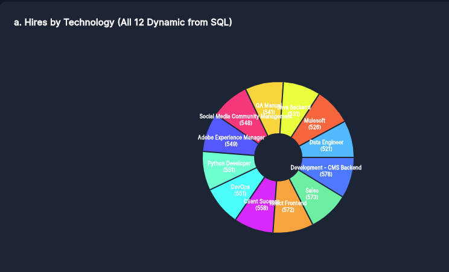
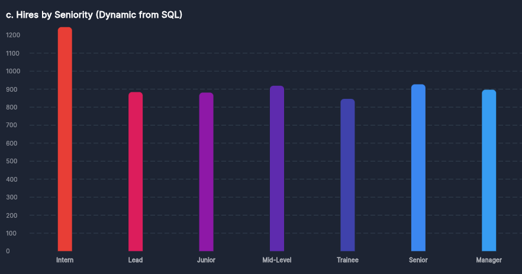
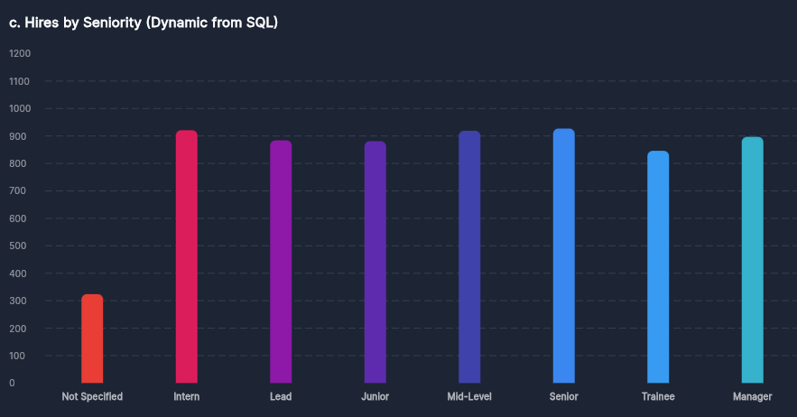
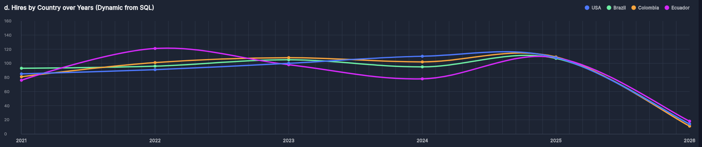

# Data Engineering Workshop - Dynamic KPI Dashboard

## Descripcion General
Desarrollo del taller práctico de ingeniería de datos enfocado en la implementación de un proceso ETL (Extracción, Transformación y Carga), limpieza de datos categóricos mediante imputación por la moda, modelado dimensional en esquema estrella utilizando Python, Pandas y PostgreSQL, y un dashboard interactivo en tiempo real con FastAPI y Flutter Web.

---

## Estructura del Repositorio
- data/raw/: Contiene el archivo CSV de datos originales.
- docs/: Documentación y entregables del taller.
- src/etl_pipeline.py: Script principal del proceso ETL.
- src/api/app.py: Backend en FastAPI que expone los endpoints analíticos.
- kpi_dashboard/: Frontend en Flutter Web para la visualización de KPIs.
- assets/: Capturas de pantalla e imágenes del dashboard (ima1, ima2, ima3, ima4).
- sql/star_schema.sql: DDL con la creación de tablas del esquema estrella (`fact_applications`, `dim_seniorities`).
- sql/kpi_queries.sql: Vistas y consultas SQL analíticas.
- .env: Credenciales y parámetros de conexión.
- requirements.txt: Dependencias de Python.

---

## Despliegue e Infraestructura
El entorno de base de datos se encuentra desplegado bajo una arquitectura en la nube y conectividad de red:
- **Infraestructura:** Servidor virtual (VM) alojado en Google Cloud Platform (GCP) con dirección IP `10.147.17.24`.
- **Contenedorización:** Motor PostgreSQL (versión 16) ejecutándose en un contenedor Docker aislado (`db_etl_workshop`) en el puerto `5433`.
- **Estrategia ETL y Calidad de Datos:** Aplicación de metodologías de ingeniería de datos, incluyendo la imputación por la moda estadística para normalizar y limpiar los valores categóricos faltantes o no especificados en las dimensiones del modelo dimensional.

---

## Vistas del Dashboard en Vivo

### 1. Resumen General de KPIs


### 2. Distribución de Contrataciones por Tecnología


### 3. Análisis de Contrataciones por Senioridad (Limpieza ETL por la Moda)


### 4. Tendencias Temporales y Geográficas


---

## Ejecucion del Proyecto

### 1. Instalar dependencias de Python
```bash
python3 -m pip install -r requirements.txt
